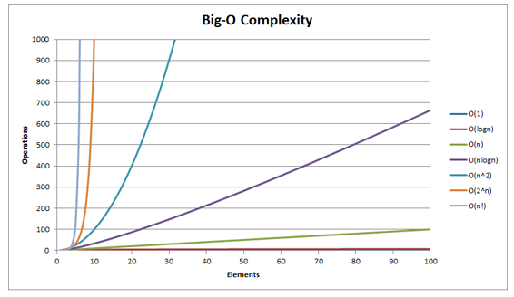
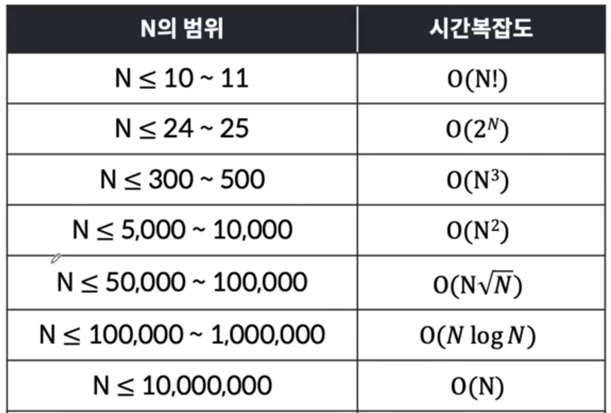

# 알고리즘 문제 풀이 방식

1. 문제를 파악한다. 문제에서 요구하는게 무엇이고 입출력은 어떠한지 확인한다.

2. 문제를 어떻게 해결할 지 흐름을 그림과 글로 써본다. 코드를 글로 써보는 것도 좋음. 한 문제를
공부하는데 2시간이 넘어가지 않게 하기 위해서 이 과정에서 1시간이 넘어가면 과감하게 힌트
를본다.

3. 문제 풀이방식이 이해가 됐다면 직접 코드를 작성해본다. 이때, 나는 초보이기 때문에 시간 복
잡도를 생각하지 않고 풀어본다. 어떻게든 결과가 제대로 출력된다면 0K. 이 과정 역시 30분이
넘어가면 과감하게 풀이를 본다.

4. 풀이 코드를 찬찬히 읽어보며 어떤 접근방식을 가져갔는 지, 어떤 함수와 라이브러리를 사용했
는 지, 내가 생각한 방식과 어떻게 다른 지 등을 보면서 코드를 따라쳐본다. 이때, 무작정 따라치
는게 아니라 흐름을 이해하면서 작성한다.

5. 풀이 코드를 보지 않고 코드를 작성해본다. 당연하게도, 초보자라면 높은 확률로 에러가 나오거
나 틀린다. 한번에 해결한다면 좋겠지만.. 다시 폴이 코드를 읽어본 후, 같은 과정을 반복한다.
이과정을 통해 흐름을 이해하고, 손과 머리에 해결방법을 익힌다.

6. 처음 알게 된 개념들을 정리한다. 중요한 과정이니 가급적이면 생략하지 말자. 이거 미루
다가 일요일이 사라질 수도 있다.

7. 다음 날, 시간이 허락하는한 같은 문제들을 다시 한 번 풀어본다. 이 과정을 통해 지금까지의
과정이 단기기억에서 장기기억으로 넘어가게 된다.

헷갈리는 알고리즘, 자료구조, 반복되는 문제에 대한 내용은 따로 문제풀이 Tip에 정리해두자.

# 문제 풀이 Tip

<details>
<summary style="font-size:20px">시간복잡도</summary>
<div markdown="1">

### 시간복잡도란???

* **입력 크기와 알고리즘간의 관계**
* 알고리즘의 복잡도를 나타내는 지표 중 하나.
* 입력 크기에 대해 프로그램의 동작시간을 가늠해볼 수 있는 수단
* Big-O / Big-Omega / Big-Theta 와 같은 표기법으로 나타낼 수 있음.

#### 문자열의 알파벳 구성을 파악하는 코드의 시간복잡도는??

```java
for(int i=0; i<str.length(); i++){
    int alphabetIndex = str.charAt(i) - 'A';
    count[alphabetIndex]++;
}
```
* int i = 0 -> +1
* i < str.length() -> L + 1
* i++ -> +L

```java
int alphabetIndex = str.charAt(i) - 'A';
count[alphabetIndex]++;
```

* 반복문이 반복되는 만큼 실행되므로 for문 안에는 + (2 * L)
  
* 총 더하면 4 * L + 2 가 나옴.
* 시간복잡도는 입력된 문자열의 길이에 4배만큼 비례함.
* O(4 * L + 2) 여기서 2와같은 상수는 생략함.
* 4와 2를 제거하면 **O(L)** 같이 나타낼 수 있음. 
  
> 입력된 문자열 길이에 비례함: O(L)

#### 이중 반복문의 시간복잡도는?

```java
long sum = 0;
for(int i=0; i<N; i++){
    for(int i=0; i<M; i++){
        sum += (long)a[i] * b[j];
    }
}
```

> 시간복잡도: O(NM)

#### 시간복잡도 그래프

 


O(logn) > O(n) > O(nlonn) > O(n^2) > O(n^3) > O(2^n) > O(n!) 

* 문제에 대한 풀이를 세우고 시간복잡도를 계산했을 때 범위안에 들어오는지를 확인함.

> 시간복잡도에 대해 알아봤는데 아직 자세히 모르겠음. 패캠 문제 풀이 계속하면서 시간복잡도 같이 알아가보면서 배우자.

</div>
</details>

<details>
<summary style="font-size:20px">배열 최대값, 최소값</summary>
<div markdown="1">

### 배열의 최대값 구하는 방법
1. Arrays.stream(arr).max.getAsInt();
2. Arrays.sort(arr) 오름차순 정렬 후 return arr[arr.length] - 1;
3. max 에 arr[0] 을 초기화 후, for문에서 arr[i] > max 일 경우 max = arr[i] 로 바꾸는 방법
</div>
</details>
